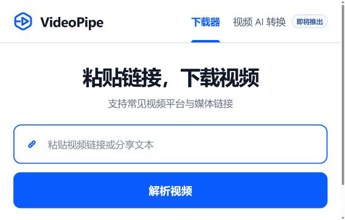

<p align="center">
  
</p>

<h1 align="center">VideoPipe</h1>

<p align="center">粘贴视频链接，选择画质，下载到本地。</p>

<p align="center">
  <a href="https://alvin20062006-beep.github.io/videopipe/">产品网站</a> ·
  <a href="https://github.com/alvin20062006-beep/videopipe/releases/download/v1.0/VideoPipe-1.0-Windows-x64-portable.zip">下载 1.0</a> ·
  <a href="https://github.com/alvin20062006-beep/videopipe/issues">问题反馈</a>
</p>



VideoPipe 1.0 是一个本地运行的视频链接下载器。输入视频链接或分享文本后，可以解析视频信息、选择画质，并在浏览器中保存下载结果。

## 功能

- 解析视频链接和包含链接的分享文本
- 提供最佳画质、720P、480P 三档选择
- 最多同时执行三个下载任务，其余任务自动排队
- 实时显示下载进度
- 支持停止正在运行的任务
- 服务重启后恢复未完成队列
- 处理 HLS/m3u8、DASH/MSS 和直接媒体链接
- yt-dlp 解析失败时使用 Playwright 与 Microsoft Edge 发现网页媒体流

## 下载 1.0

Windows 用户可以直接下载 [VideoPipe 1.0 便携版](https://github.com/alvin20062006-beep/videopipe/releases/download/v1.0/VideoPipe-1.0-Windows-x64-portable.zip)。压缩包已包含 Python、FFmpeg、yt-dlp、aria2、N_m3u8DL-RE 和应用所需的 Python 包；完整解压后双击 `VideoPipe.cmd` 即可使用。

需要从源码运行或参与开发时，也可以直接克隆仓库：

```powershell
git clone https://github.com/alvin20062006-beep/videopipe.git
cd videopipe
```

## 运行环境

- Windows 10/11 64 位
- PowerShell 5.1 或更高版本
- Python 3.11 或更高版本
- Microsoft Edge

Aria2、N_m3u8DL-RE 和项目所需的 Python 依赖会由安装脚本准备。FFmpeg 由 `imageio-ffmpeg` 提供。

## 安装与启动

在项目目录打开 PowerShell，首次运行：

```powershell
powershell -ExecutionPolicy Bypass -File .\install-dependencies.ps1
powershell -ExecutionPolicy Bypass -File .\start.ps1
```

安装完成后，以后只需运行：

```powershell
.\start.ps1
```

浏览器访问地址：

```text
http://127.0.0.1:8765/
```

安装脚本只会写入当前项目的 `.venv/` 和 `vendor/`，不会申请管理员权限或修改系统目录。

## 手动启动

```powershell
python -m venv .venv
.\.venv\Scripts\python.exe -m pip install -r requirements.txt
.\.venv\Scripts\python.exe -m uvicorn app:app --host 127.0.0.1 --port 8765
```

开发时可以在启动命令末尾添加 `--reload`。

## 下载引擎

| 组件 | 用途 |
| --- | --- |
| `yt-dlp` | 网站解析、普通视频和 HLS 分片下载 |
| `Aria2` | 普通直链多连接下载 |
| `N_m3u8DL-RE` | DASH/MSS 清单下载 |
| `FFmpeg` | 媒体封装与处理 |
| `Playwright + Edge` | 网页媒体流发现 |

## 测试

```powershell
.\.venv\Scripts\python.exe -m pip install pytest
.\.venv\Scripts\python.exe -m pytest -q
```

## 数据与隐私

任务数据库和临时下载文件保存在本地 `data/` 目录。下载结果交付给浏览器后，VideoPipe 会清理对应的临时任务目录。

解析链接时，VideoPipe 会访问链接对应的网站。微信视频号公开分享链接可能使用第三方解析服务。请不要在链接中包含账号、密码或其他敏感信息。

以下内容不会提交到 Git：

- Python 虚拟环境和缓存
- 任务数据库及下载文件
- 未完成的下载分片
- 第三方下载器二进制文件

## 问题反馈

如果遇到错误，请在 [GitHub Issues](https://github.com/alvin20062006-beep/videopipe/issues) 提交问题，并提供：

- Windows 与 Python 版本
- 使用的链接类型
- 完整错误信息
- 可以公开复现的步骤

请勿提交 Cookie、账号信息、私人链接或已下载的视频文件。

## 使用说明

请仅下载自己拥有、已经购买或获得授权使用的内容，并遵守内容来源网站的使用条款及所在地法律。
